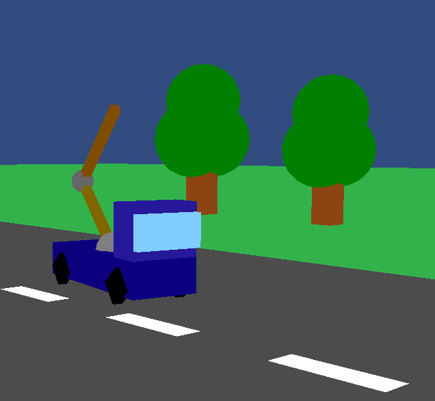

# openGL_crane

C++ code to render and control a truck-mounted crane on a limited 3D space, using OpenGL 3.3+.
Controlled with WASD, different camera modes with ZXCV.

   ```bash
   g++ -o grua grua.cpp dibujo.c -lGL -lglad -lglfw -lm
   ```

